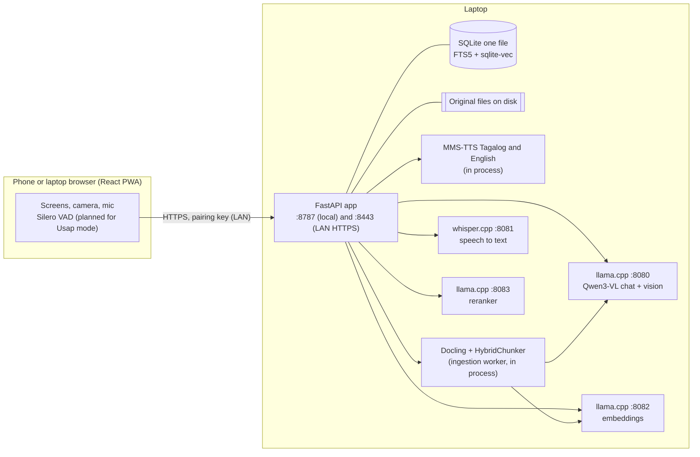

# Architecture

Everything runs on one laptop. The phone is a browser client. No component calls a cloud AI service.



`run.sh` starts the four model servers on 127.0.0.1, then the app twice: on 8787 (loopback, no pairing needed) and on 8443 (all interfaces, HTTPS with a self-signed certificate, pairing key required).

## Components

| Component | Where | Role |
|---|---|---|
| Web app | `frontend/` | React 19 + Vite, built into `backend/static` and served by FastAPI |
| API | `backend/kapiling/main.py` | App, pairing middleware, `/api/health` |
| Auth | `backend/kapiling/auth/` | PIN hashing, sessions, lockout, access log, WebAuthn |
| Records | `backend/kapiling/records/` | Profiles, cards, medicines, observations, emergency card, summary |
| Documents | `backend/kapiling/docs/` | Upload, vision transcript, Docling chunking, index, hybrid retrieval |
| Chat | `backend/kapiling/chat/` | Agent loop, tools, AG-UI events, run registry, safety blocks, form filler |
| Voice | `backend/kapiling/voice/` | Whisper client, MMS-TTS, sentence aggregation, turn timing |
| Chat and vision model | llama.cpp :8080 | Qwen3-VL-8B-Instruct Q4_K_M with mmproj |
| Speech to text | whisper.cpp :8081 | large-v3-turbo, with a Taglish health-word prompt |
| Embeddings | llama.cpp :8082 | Qwen3-Embedding-0.6B Q8_0 (1024 dimensions) |
| Reranker | llama.cpp :8083 | bge-reranker-v2-m3 Q8_0 |
| Store | SQLite | One file in `KAPILING_DATA`, with FTS5 and sqlite-vec |

## Chat event flow (AG-UI over SSE)

`POST /api/runs` takes only the new message (text, photos, or audio) and the conversation id. The server loads history from its own store, runs the agent as its own task (a client disconnect ends the stream, not the run), and returns `text/event-stream`. Input errors return an HTTP status before the stream starts.

```
RUN_STARTED
  [CUSTOM transcript]                    voice turns only
  STEP_STARTED / STEP_FINISHED           e.g. search_records, check_meds
  TOOL_CALL_START / TOOL_CALL_END
  CUSTOM block                           card, med_list, lab_table, disclaimer, refusal ...
  CUSTOM sources                         numbered citations
  TEXT_MESSAGE_START / CONTENT* / END    tokens
  [CUSTOM audio]*                        one WAV per sentence, when speak=1
  CUSTOM timing
RUN_ERROR                                on failure
RUN_FINISHED  (result.messageId, status)
```

The assistant message is saved before `RUN_FINISHED`, which carries the saved message id and a status of `complete`, `stopped`, `interrupted` or `failed`. `POST /api/runs/{run_id}/cancel` stops a run. The agent makes at most 5 model steps per run. Full event list: [api.md](api.md).

## Voice pipeline

A voice turn is the same run as a chat turn.

1. The client uploads the utterance as `audio` with the run request (up to 25 MB).
2. The server sends it to whisper.cpp and emits `CUSTOM transcript`.
3. The agent answers as for text. Model tokens go through a sentence aggregator.
4. Each finished sentence is synthesised by MMS-TTS (Tagalog or English by the run's `lang`) and sent as `CUSTOM audio` with a sequence number. Text streams on screen as well.
5. A per-turn timing line is recorded in `turn_timings`.

`POST /api/speak` reads one reply aloud on demand (up to 400 characters). Latency is **to be measured**: the spec's target (under 2.5 s from end of speech to first audio) and its per-stage budget are guesses, not measurements. The browser side (push-to-talk button, Silero VAD, Usap mode) is not merged yet.

## Document ingestion

One background worker processes one document at a time, because the vision model is the bottleneck.

```
upload (validated by bytes) -> queued
  -> reading:  photo: Qwen3-VL transcribes to markdown with tables
               PDF:   Docling parses (layout + TableFormer, OCR off)
  -> HybridChunker, token budget 512 by the embedding model's tokenizer
  -> embeddings in batches of 32 (llama.cpp :8082)
  -> one transaction: chunks + FTS5 + sqlite-vec rows + proposed observations
  -> indexed
```

The vision pass also returns lab values as JSON (test, value, unit, reference range, date, facility). A numeric value that is not written in the transcript is rejected. The values are stored in `observations` with status `proposed`; charts and "latest result" answers use only `confirmed` ones, and the person confirms or removes them on the review screen. A failed document keeps status `failed` and an error.

## Hybrid retrieval

`docs/retrieve.py`, always filtered by profile inside the query:

1. FTS5 keyword search and sqlite-vec vector search (cosine).
2. Reciprocal rank fusion, `k = 60`; the top 24 candidates continue.
3. Rerank with bge-reranker-v2-m3.
4. Drop anything below the score floor, keep the top 6.
5. Return citations with `before`, `match` and `after` text and the chunk, document and page.

The floor (`RERANK_FLOOR`) is currently **-3.0, provisional**, taken from one live pair of scores. The evaluation harness in `backend/eval/` calibrates it; its results table is still empty, so no recall figure is claimed. If the reranker or embedding server is down, the search tool reports that records search is unavailable.

## Data model (contract C1, `user_version = 1`)

| Group | Tables |
|---|---|
| Person | `profiles`, `emergency_fields`, `contacts`, `conditions`, `allergies`, `family_history` |
| Medicines and vaccines | `medications`, `med_logs`, `vaccines` |
| Cards | `cards` (kinds: philhealth, senior, hmo, pwd, vaccination, national_id, other) |
| History | `visits`, `observations` (status `proposed` or `confirmed`), `documents` (status queued, reading, indexed, failed) |
| Search | `chunks`, `chunks_fts` (FTS5), `chunks_vec` (sqlite-vec, `FLOAT[1024]`, partitioned by profile) |
| Chat | `conversations`, `messages` (blocks, steps, sources as JSON), `turn_timings` |
| Access | `owner_lock`, `representatives`, `access_log` |

Structured facts (allergies, medicines, lab values) live in plain tables and are fetched exactly by tool calls. Documents live as files plus chunks and are found by retrieval. A short essential summary of the record is also placed in the system prompt.
